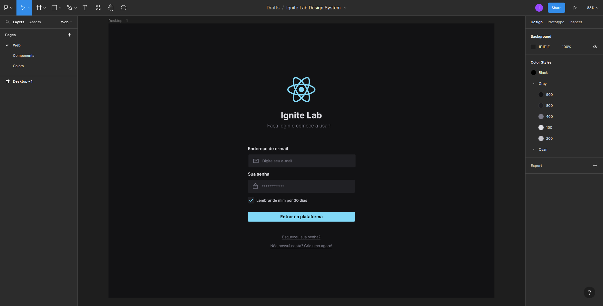
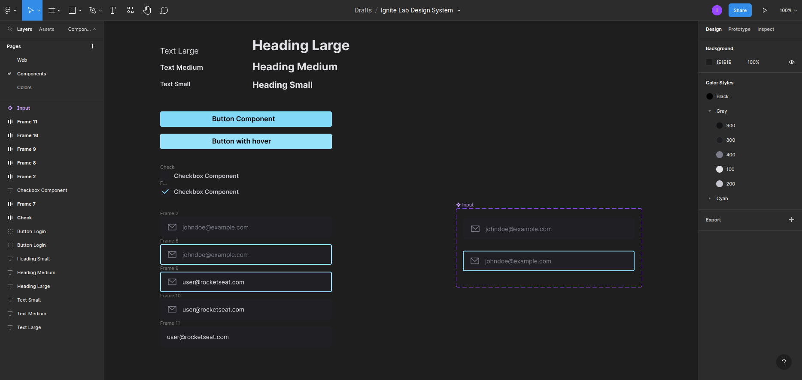
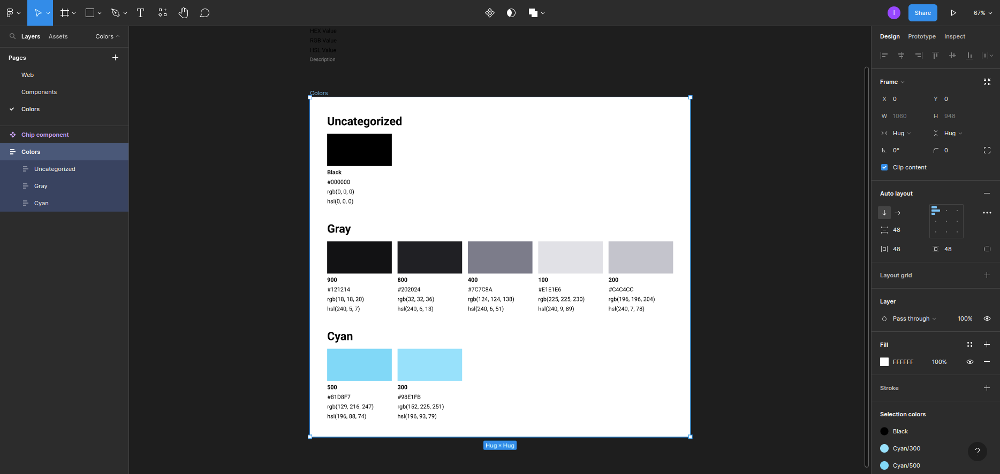
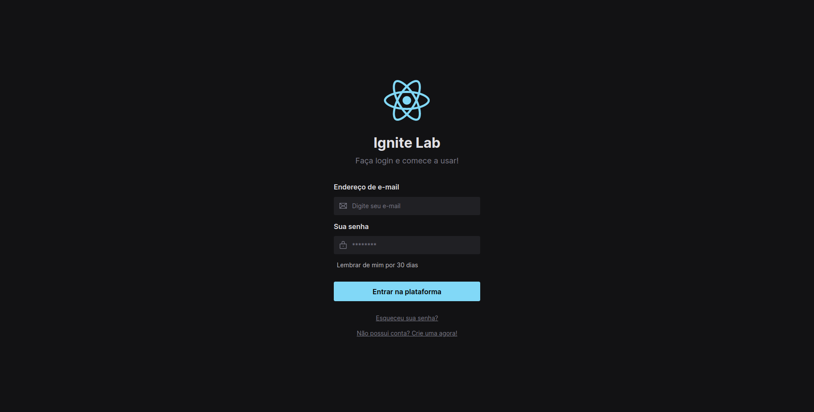

# Ignite Lab - Do Figma ao React

## Projeto realizado durante o evento da Rocketseat nos dias 11 a 14 de outubro.

---

Deploy da documentação no Storybook:

[Link - Storybook](https://igorhleal.github.io/ignite-lab-design-system/?path=/story/components-button--default)

---

### Ferramentas utilizadas:

* *Tailwind*
* *Typescript*
* *Radix (Slot)*
* *Axios*
* *Storybook*
* *Figma*
* *clsx*
* *Phosphor-react*

---

###  Iniciando aplicação:

* Clone o repositório: `git clone git@github.com:IgorHLeal/ignite-lab-design-system.git`

* Instale as dependências do projeto: `npm install`

* Dê um 'start' na aplicação: `npm run dev` -

* Dê um'start' no storybook: `npm run storybook`

---

### Sobre o desenvolvimento e a aplicação

Construção do protótipo no Figma:

-----

Componentização no Figma:

---

Construção dos tokens de cores no Figma:

---

Tela de login da aplicação:

